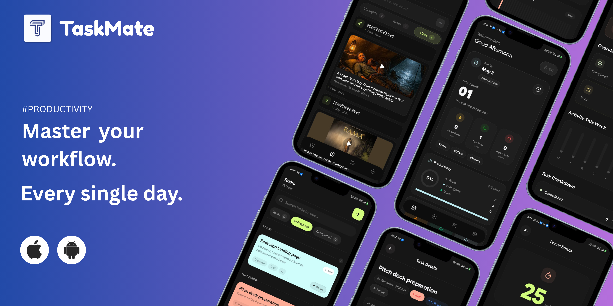

# TaskMate 

<p align="center">
  
</p>

A **privacy-first** task management app with built-in focus timer, streak tracking, and analytics. Built with React Native for iOS and Android.

---

## ✨ Features

### 📋 Task Management
- Create, organize, and track tasks with ease
- Custom categories: To Do, In Progress, Completed
- Task details with priority and due dates
- Swipeable task cards with animated interactions

### ⏱️ Focus Timer
- Pomodoro-style focus timer (default 25 minutes)
- Animated circular progress indicator
- Link timer to specific tasks for focused work
- Confetti celebration on completion! 🎉

### 🔥 Streak Tracking
- Daily streak tracking to keep you motivated
- Streak counter on home screen
- Push notification reminders at 8 PM

### 🧠 Brain Dump
- Quick capture for ideas and tasks
- Instant task creation from any thought

### 📊 Analytics
- Weekly activity bar chart
- Task breakdown by status
- Completion statistics
- Streak history

### 📅 Calendar View
- View tasks by date
- Monthly task schedule visualization

### 🔒 Privacy-First
- **All data stored locally on device**
- Your data never leaves your device
- No accounts, no cloud, no tracking
- Optional encryption for task data

### 📲 Share Intent Support
- Receive shared content from other apps
- Create tasks directly from sharing

---

## 📱 Screens

| Home Screen | Focus Timer | Analytics | Tasks |
|:---:|:---:|:---:|:---:|
| Home dashboard | Focus Timer with animated circular countdown | Weekly stats & task breakdown | Task list with management |

### Navigation Structure
- **Home** - Dashboard with streak, recent tasks, weekly focus widget
- **Brain Dump** - Quick idea capture
- **Tasks** - Full task management list
- **Settings** - App info, analytics, calendar access

---

## 🛠 Tech Stack

| Category | Technology |
|----------|------------|
| **Framework** | React Native 0.84 |
| **Language** | TypeScript |
| **Navigation** | React Navigation 7 (Bottom Tabs + Native Stack) |
| **Storage** | AsyncStorage |
| **Notifications** | Notifee |
| **Icons** | Lucide React Native |
| **SVG** | React Native SVG |
| **Confetti** | React Native Confetti Cannon |
| **Animations** | React Native Animated + PanResponder |

---

## 🚀 Getting Started

### Prerequisites
- Node.js >= 22.11.0
- React Native CLI
- Android Studio (for Android)
- Xcode (for iOS)

### Installation

```bash
# Clone the repository
git clone https://github.com/yourusername/TaskMate.git
cd TaskMate

# Install dependencies
npm install

# Run on Android
npm run android

# Run on iOS (macOS only)
npm run ios
```

### Build APK (Android)

```bash
# Debug build
cd android && ./gradlew assembleDebug

# Release build
cd android && ./gradlew assembleRelease
```

The APK will be at: `android/app/build/outputs/apk/debug/app-debug.apk`

---

## 🏗 Project Structure

```
TaskMate/
├── App.tsx                 # App entry point
├── src/
│   ├── components/         # Reusable UI components
│   │   ├── AddTaskBottomSheet.tsx
│   │   ├── TaskCard.tsx
│   │   ├── BottomSheet.tsx
│   │   └── ...
│   ├── screens/            # App screens
│   │   ├── HomeScreen.tsx
│   │   ├── FocusScreen.tsx
│   │   ├── AnalyticsScreen.tsx
│   │   └── ...
│   ├── navigation/         # Navigation config
│   │   └── TabNavigator.tsx
│   ├─��� hooks/              # Custom hooks
│   │   ├── useTaskManager.ts
│   │   └── useStreak.ts
│   ├── context/           # React Context
│   │   └── TimerContext.tsx
│   ├── services/          # Native services
│   │   └── NotificationService.ts
│   ├── data/              # Theme & data
│   │   └── color-theme.tsx
│   ├── domain/            # Business logic
│   │   └── usecases/
│   └── layouts/           # Screen layouts
├── android/              # Android native code
└── ios/                  # iOS native code
```

---

## 🎨 Design System

### Colors (Dark Theme)
| Color | Hex | Usage |
|-------|-----|-------|
| Background | `#1F1F1F` | Main background |
| Text | `#F6F5F8` | Primary text |
| Primary 1 | `#FFECA0` | Yellow accent |
| Primary 2 | `#CFE9BC` | Green accent |
| Primary 3 | `#BBE7EF` | Blue accent |
| Primary 4 | `#FF8C6F` | Orange/Coral accent |
| Error | `#FFA6A6` | Error states |

### Typography
- **Font**: Google Sans Flex
- Weights: Thin, ExtraLight, Light, Regular, Medium, SemiBold, Bold, ExtraBold, Black

---

## 📄 License

MIT License - See LICENSE file for details.

---

## 🙏 Acknowledgments

- [React Native](https://reactnative.dev/)
- [React Navigation](https://reactnavigation.org/)
- [Lucide Icons](https://lucide.dev/)
- [Notifee](https://notifee.app/)

---

<div align="center">

**Built with ❤️ for Privacy** 🛡️

</div>
